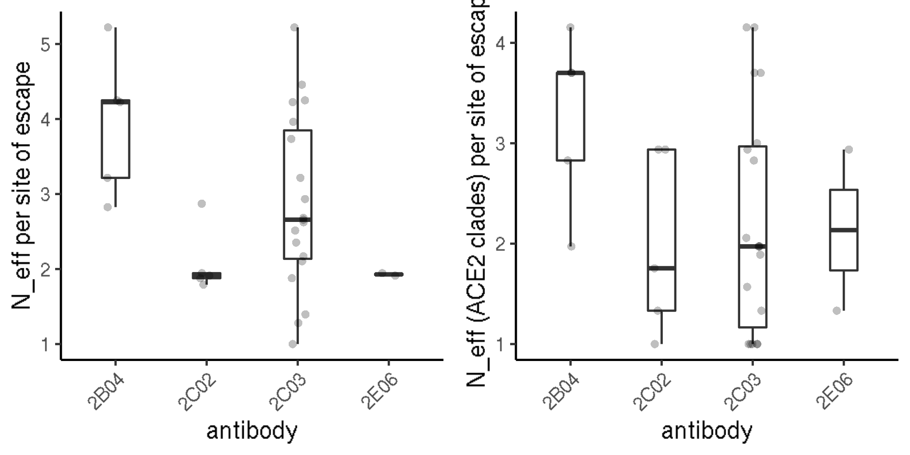
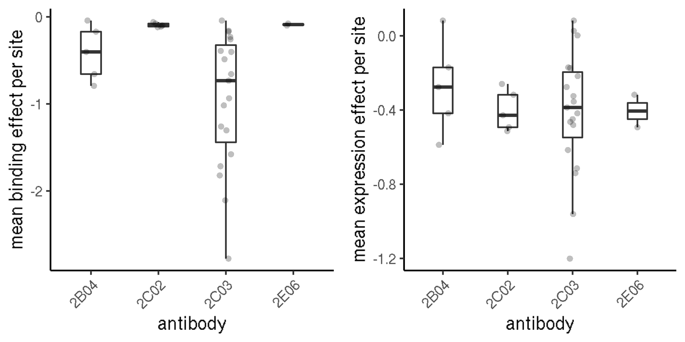
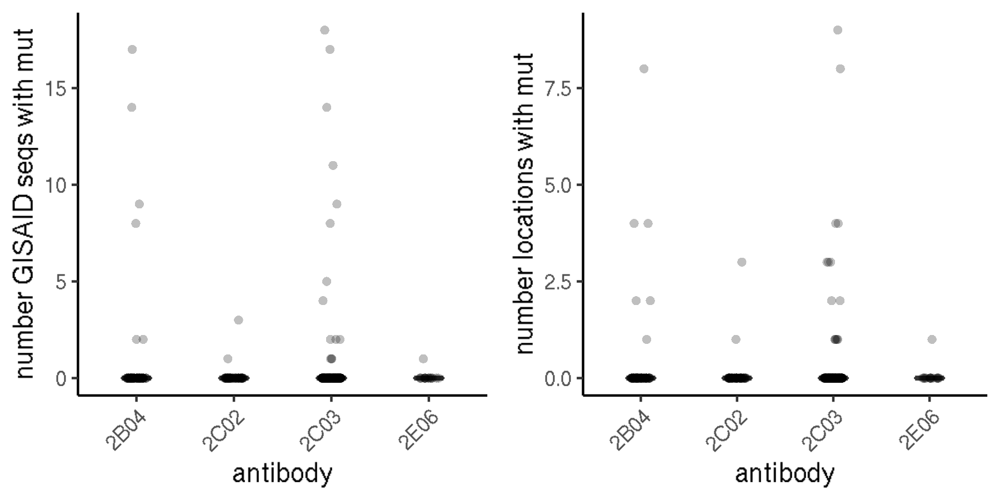
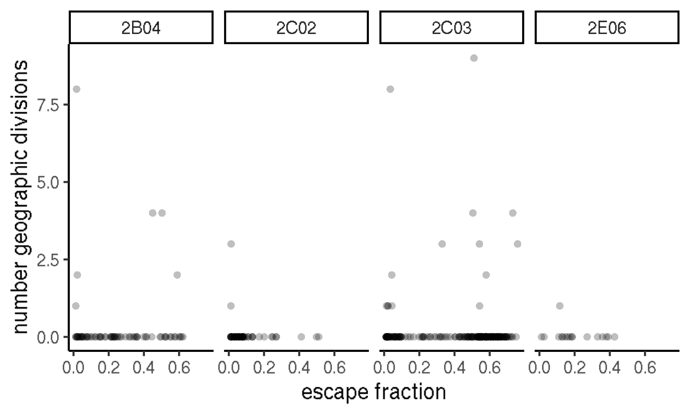

Evolution and escape for Ellebedy mAbs
================
8/14/2020

-   [Setup](#setup)
-   [Sarbecovirus conservation at sites of
    escape](#sarbecovirus-conservation-at-sites-of-escape)
-   [DMS functional constraint at sites of
    escape](#dms-functional-constraint-at-sites-of-escape)
-   [Circulating mutants at sites of
    escape](#circulating-mutants-at-sites-of-escape)

This notebook analyzes mAb escape scores for protective murine mAbs in
light of evolutionary and functional considerations. This includes
comparison to evolutionary conservation of positions among
sarbecoviruses, consideration of circulating variants in current
pandemic isolates, and relating escape scores to consideration of
functional constraint from our deep mutational scanning measurements.

Setup
-----

    #list of packages to install/load
    packages = c("yaml","data.table","tidyverse","gridExtra","bio3d","knitr")
    #install any packages not already installed
    installed_packages <- packages %in% rownames(installed.packages())
    if(any(installed_packages == F)){
      install.packages(packages[!installed_packages])
    }
    #load packages
    lapply(packages, library, character.only=T)

    ## [[1]]
    ## [1] "yaml"      "stats"     "graphics"  "grDevices" "utils"     "datasets" 
    ## [7] "methods"   "base"     
    ## 
    ## [[2]]
    ## [1] "data.table" "yaml"       "stats"      "graphics"   "grDevices" 
    ## [6] "utils"      "datasets"   "methods"    "base"      
    ## 
    ## [[3]]
    ##  [1] "forcats"    "stringr"    "dplyr"      "purrr"      "readr"     
    ##  [6] "tidyr"      "tibble"     "ggplot2"    "tidyverse"  "data.table"
    ## [11] "yaml"       "stats"      "graphics"   "grDevices"  "utils"     
    ## [16] "datasets"   "methods"    "base"      
    ## 
    ## [[4]]
    ##  [1] "gridExtra"  "forcats"    "stringr"    "dplyr"      "purrr"     
    ##  [6] "readr"      "tidyr"      "tibble"     "ggplot2"    "tidyverse" 
    ## [11] "data.table" "yaml"       "stats"      "graphics"   "grDevices" 
    ## [16] "utils"      "datasets"   "methods"    "base"      
    ## 
    ## [[5]]
    ##  [1] "bio3d"      "gridExtra"  "forcats"    "stringr"    "dplyr"     
    ##  [6] "purrr"      "readr"      "tidyr"      "tibble"     "ggplot2"   
    ## [11] "tidyverse"  "data.table" "yaml"       "stats"      "graphics"  
    ## [16] "grDevices"  "utils"      "datasets"   "methods"    "base"      
    ## 
    ## [[6]]
    ##  [1] "knitr"      "bio3d"      "gridExtra"  "forcats"    "stringr"   
    ##  [6] "dplyr"      "purrr"      "readr"      "tidyr"      "tibble"    
    ## [11] "ggplot2"    "tidyverse"  "data.table" "yaml"       "stats"     
    ## [16] "graphics"   "grDevices"  "utils"      "datasets"   "methods"   
    ## [21] "base"

    knitr::opts_chunk$set(echo = T)
    knitr::opts_chunk$set(dev.args = list(png = list(type = "cairo")))

    #read in config file
    config <- read_yaml("config.yaml")

    #read in file giving concordance between RBD numbering and SARS-CoV-2 Spike numbering
    RBD_sites <- read.csv(config$RBD_sites,stringsAsFactors = F)

    #make output directory
    output_dir <- config$ellebedy_evolution_dir
    if(!file.exists(output_dir)){
      dir.create(file.path(output_dir))
    }

Session info for reproducing environment:

    sessionInfo()

    ## R version 3.6.2 (2019-12-12)
    ## Platform: x86_64-pc-linux-gnu (64-bit)
    ## Running under: Ubuntu 18.04.4 LTS
    ## 
    ## Matrix products: default
    ## BLAS/LAPACK: /app/software/OpenBLAS/0.3.7-GCC-8.3.0/lib/libopenblas_haswellp-r0.3.7.so
    ## 
    ## locale:
    ##  [1] LC_CTYPE=en_US.UTF-8       LC_NUMERIC=C              
    ##  [3] LC_TIME=en_US.UTF-8        LC_COLLATE=en_US.UTF-8    
    ##  [5] LC_MONETARY=en_US.UTF-8    LC_MESSAGES=en_US.UTF-8   
    ##  [7] LC_PAPER=en_US.UTF-8       LC_NAME=C                 
    ##  [9] LC_ADDRESS=C               LC_TELEPHONE=C            
    ## [11] LC_MEASUREMENT=en_US.UTF-8 LC_IDENTIFICATION=C       
    ## 
    ## attached base packages:
    ## [1] stats     graphics  grDevices utils     datasets  methods   base     
    ## 
    ## other attached packages:
    ##  [1] knitr_1.26        bio3d_2.4-0       gridExtra_2.3     forcats_0.4.0    
    ##  [5] stringr_1.4.0     dplyr_0.8.3       purrr_0.3.3       readr_1.3.1      
    ##  [9] tidyr_1.0.0       tibble_3.0.2      ggplot2_3.3.0     tidyverse_1.3.0  
    ## [13] data.table_1.12.8 yaml_2.2.0       
    ## 
    ## loaded via a namespace (and not attached):
    ##  [1] tidyselect_1.1.0 xfun_0.11        haven_2.2.0      colorspace_1.4-1
    ##  [5] vctrs_0.3.1      generics_0.0.2   htmltools_0.4.0  rlang_0.4.7     
    ##  [9] pillar_1.4.5     glue_1.3.1       withr_2.1.2      DBI_1.1.0       
    ## [13] dbplyr_1.4.2     modelr_0.1.5     readxl_1.3.1     lifecycle_0.2.0 
    ## [17] munsell_0.5.0    gtable_0.3.0     cellranger_1.1.0 rvest_0.3.5     
    ## [21] evaluate_0.14    parallel_3.6.2   fansi_0.4.0      broom_0.7.0     
    ## [25] Rcpp_1.0.3       scales_1.1.0     backports_1.1.5  jsonlite_1.6    
    ## [29] fs_1.3.1         hms_0.5.2        digest_0.6.23    stringi_1.4.3   
    ## [33] grid_3.6.2       cli_2.0.0        tools_3.6.2      magrittr_1.5    
    ## [37] crayon_1.3.4     pkgconfig_2.0.3  ellipsis_0.3.0   xml2_1.2.2      
    ## [41] reprex_0.3.0     lubridate_1.7.4  assertthat_0.2.1 rmarkdown_2.0   
    ## [45] httr_1.4.1       rstudioapi_0.10  R6_2.4.1         compiler_3.6.2

Load in relevant data for analyses: escape scores for the Ellebedy mAbs,
deep mutational scanning scores, and sites of significant escape for
these antibodies.

    dms <- read.csv(file=config$mut_bind_expr,stringsAsFactors = F)
    dt <- data.table(read.csv(file=config$escape_fracs,stringsAsFactors=F));dt <- dt[selection %in% c("2B04_400","2C02_400","2C03_400","mAb-2E06_400"),];dt <- dt[library=="average",]

    dt[,dms_bind := dms[dms$site_SARS2 == label_site & dms$mutant == mutation,"bind_avg"],by=c("label_site","mutation")]
    dt[,dms_expr := dms[dms$site_SARS2 == label_site & dms$mutant == mutation,"expr_avg"],by=c("label_site","mutation")]

    sig_sites <- read.csv(file=config$significant_escape_sites,stringsAsFactors=F); sig_sites <- sig_sites[sig_sites$condition %in% c("2B04_400","2C02_400","2C03_400","mAb-2E06_400"),]

    sig_sites[sig_sites$condition=="2B04_400","condition"] <- "2B04";sig_sites[sig_sites$condition=="2C02_400","condition"] <- "2C02";sig_sites[sig_sites$condition=="2C03_400","condition"] <- "2C03";sig_sites[sig_sites$condition=="mAb-2E06_400","condition"] <- "2E06"

    dt[dt$selection=="2B04_400","selection"] <- "2B04";dt[dt$selection=="2C02_400","selection"] <- "2C02";dt[dt$selection=="2C03_400","selection"] <- "2C03";dt[dt$selection=="mAb-2E06_400","selection"] <- "2E06"

Sarbecovirus conservation at sites of escape
--------------------------------------------

Let’s first look at the conservation of amino acid residues that are
significantly selected by each mAb. To look at this, we calculate `Neff`
from the sarbecovirus RBD alignment given in
`config$sarbecovirus_alignment`. We also compute a “restricted”
sarbecovirus set `Neff_restricted`, which is computed from the
SARS-CoV-1 and -2 clade sequences, the only ones known to bind ACE2 (and
for which neutralizing breadth would be particularly important). This
does create a quite small alignment, though, so it is unclear how well
these `Neff_restricted` metrics reflect evolutionary constraint.

    alignment <- bio3d::read.fasta(file=config$sarbecovirus_alignment)
    #remove columns that is gap in the SARS-CoV-2 sequence (only one is a single A insertion in the BM48-31 sequence)
    alignment$ali <- alignment$ali[,which(alignment$ali[1,]!="-")]

    #get indices for alignment rows which correspond to sequences from each of the sarbecovirus 'clades'
    clade1 <- which(alignment$id %in% c("SARS_Urbani_AY278741","WIV1_KF367457","WIV16_KT444582","LYRa11_KF569996",
                                        "Rs7327_KY417151","Rs4231_KY417146","RsSHC014_KC881005","Rs4084_KY417144"))

    cladeSARS2 <- which(alignment$id %in% c("SARS-CoV-2_MN908947","Pangolin_GD-consensus_EPI_ISL_410544-Lam2020_supplement",
                                            "RaTG13_MN996532","Pangolin_GX-P2V_EPI_ISL_410542"))

    clade2 <- which(alignment$id %in% c("As6526_KY417142","Rs4237_KY417147","Rs4081_KY417143","Rp3_DQ071615","Shaanxi2011_JX993987","279-2005_DQ648857",
                                        "Yunnan2011_JX993988","YN2013_KJ473816","Rf4092_KY417145","ZXC21_MG772934","ZC45_MG772933","JL2012_KJ473811",
                                        "Rf1_DQ412042","HeB2013_KJ473812","273-2005_DQ648856","RmYN02_EPI_ISL_412977","Rs4247_KY417148","HKU3-13_GQ153548",
                                        "HKU3-1_DQ022305","GX2013_KJ473815","Longquan-140_KF294457","HKU3-8_GQ153543","HuB2013_KJ473814"))

    clade3 <- which(alignment$id %in% c("BM48-31_NC014470","BtKY72_KY352407"))

    #make a second alignment which is only the clade 1 and sars-cov-2 clade sequences, where ACE2-binding is present
    alignment_restricted <- alignment;alignment_restricted$ali <- alignment$ali[c(clade1,cladeSARS2),]; alignment_restricted$id <- alignment$id[c(clade1,cladeSARS2)]

    entropy <- entropy(alignment)$H
    entropy_restricted <- entropy(alignment_restricted)$H
    RBD_sites$entropy <- entropy
    RBD_sites$Neff <- 2^(entropy)
    RBD_sites$entropy_restricted <- entropy_restricted
    RBD_sites$Neff_restricted <- 2^(entropy_restricted)

    for(i in 1:nrow(sig_sites)){
      sig_sites$Neff[i] <- RBD_sites[RBD_sites$site_SARS2==sig_sites$site[i],"Neff"]
      sig_sites$Neff_restricted[i] <- RBD_sites[RBD_sites$site_SARS2==sig_sites$site[i],"Neff_restricted"]
    }

    p1 <- ggplot(sig_sites,aes(x=condition,y=Neff))+
            geom_boxplot(outlier.shape=NA, width=0.3, outlier.alpha=0.25)+
            geom_jitter(width=0.1, height=0, alpha=0.25, shape=16)+
            theme_classic()+
            xlab("antibody")+ylab("N_eff per site of escape")+theme(axis.text.x=element_text(angle=45,hjust=1))
            
    p2 <- ggplot(sig_sites,aes(x=condition,y=Neff_restricted))+
            geom_boxplot(outlier.shape=NA, width=0.3, outlier.alpha=0.25)+
            geom_jitter(width=0.1, height=0, alpha=0.25, shape=16)+
            theme_classic()+
            xlab("antibody")+ylab("N_eff (ACE2 clades) per site of escape")+theme(axis.text.x=element_text(angle=45,hjust=1))

    grid.arrange(p1,p2,nrow=1)

    invisible(dev.print(pdf, paste(output_dir,"/distribution-Neff_per_epitope.pdf",sep=""), useDingbats=F))

DMS functional constraint at sites of escape
--------------------------------------------

What is the constraint per position (from our DMS measurements) for each
antibody’s set of escape sites? We can do two things here – look at the
average effect per site (general constraint), and look at the intrinsic
constraint for particular escape mutations (specific constraint).

The first plots below show the mean mutation effect per site on binding
(left) and expression (right) for sites of significant escape from each
mAb.

    for(i in 1:nrow(sig_sites)){
      sig_sites$mean_bind[i] <- mean(dms[dms$site_SARS2==sig_sites$site[i] & dms$mutant != dms$wildtype & dms$mutant != "*", "bind_avg"],na.rm=T)
      sig_sites$mean_expr[i] <- mean(dms[dms$site_SARS2==sig_sites$site[i] & dms$mutant != dms$wildtype & dms$mutant != "*", "expr_avg"],na.rm=T)
    }

    p1 <- ggplot(sig_sites,aes(x=condition,y=mean_bind))+
            geom_boxplot(outlier.shape=NA, width=0.3, outlier.alpha=0.25)+
            geom_jitter(width=0.1, height=0, alpha=0.25, shape=16)+
            theme_classic()+
            xlab("antibody")+ylab("mean binding effect per site")+theme(axis.text.x=element_text(angle=45,hjust=1))

    p2 <- ggplot(sig_sites,aes(x=condition,y=mean_expr))+
            geom_boxplot(outlier.shape=NA, width=0.3, outlier.alpha=0.25)+
            geom_jitter(width=0.1, height=0, alpha=0.25, shape=16)+
            theme_classic()+
            xlab("antibody")+ylab("mean expression effect per site")+theme(axis.text.x=element_text(angle=45,hjust=1))

    grid.arrange(p1,p2,nrow=1)

    invisible(dev.print(pdf, paste(output_dir,"/distribution_mean-dms-score_per_epitope.pdf",sep=""), useDingbats=F))

Next, for each mAb, we make exploratory plots showing the effect of
individual mutations at sites of significant escape on DMS binding or
expression versus antibody escape. We don’t know exactly what the cutoff
is for tolerability of real escape mutations with side-effects on
binding or expression – however, we can use previous sets of selected
escape mutations in lab/cell culture antibody selections, to see what
range of phenotypic values are observed in these “lab-selected” escape
mutations, which Allie collated in a table `config$literature_escapes`.
The dashed lines on these plots are the 95th percentile of binding and
expression DMS scores for these lab-selected escape mutations (or is it
5th percentile? 95% of lab-escape mutants have binding/expression this
value or higher).

Note, at some point, we might also want to layer on filters based on
positions where we think that we are missing constraint from our DMS
values. Sarah’s `phydms` analyses would be a place to start, as she has
identified positions that are more constrained in nature than would be
expected from DMS values.

    lit_escapes <- read.csv(file=config$literature_escapes,stringsAsFactors = F); lit_escapes <- lit_escapes[lit_escapes$study_short %in% c("Regeneron","NYC"),]
    for(i in 1:nrow(lit_escapes)){
      lit_escapes$dms_bind[i] <- dms[dms$mutation == lit_escapes$mutation[i],"bind_avg"]
      lit_escapes$dms_expr[i] <- dms[dms$mutation == lit_escapes$mutation[i],"expr_avg"]
    }

    #hist(lit_escapes$dms_bind,breaks=10)
    #what's the 95th percentile in bind and expr escape scores among these lit mutants?
    bind_threshold <- as.numeric(quantile(lit_escapes$dms_bind,0.05))
    expr_threshold <- as.numeric(quantile(lit_escapes$dms_expr,0.05))

    par(mfrow=c(4,2))
    for(mAb in c("2B04","2C02","2C03","2E06")){
      plot(dt[selection==mAb & label_site %in% sig_sites[sig_sites$condition==mAb,"site"],mut_escape_frac_epistasis_model],
         dt[selection==mAb & label_site %in% sig_sites[sig_sites$condition==mAb,"site"],dms_bind],
         xlab="fraction escape",ylab="DMS binding score",main=mAb,pch=16,
         xlim=range(dt$mut_escape_frac_epistasis_model),ylim=range(dt[label_site %in% sig_sites$site,dms_bind])); abline(h=bind_threshold,lty=2,col="gray50")
      plot(dt[selection==mAb & label_site %in% sig_sites[sig_sites$condition==mAb,"site"],mut_escape_frac_epistasis_model],
           dt[selection==mAb & label_site %in% sig_sites[sig_sites$condition==mAb,"site"],dms_expr],
           xlab="fraction escape",ylab="DMS expression score",main=mAb,pch=16,
           xlim=range(dt$mut_escape_frac_epistasis_model),ylim=range(dt[label_site %in% sig_sites$site,dms_expr])); abline(h=expr_threshold,lty=2,col="gray50")
    }

    invisible(dev.print(pdf, paste(output_dir,"/plots_dms-score_per_mut.pdf",sep=""), useDingbats=F))

Circulating mutants at sites of escape
--------------------------------------

Finally, let’s look at the number of circulating amino-acid variants
within sites of escape from each mAb. We can look at general prevalence
of mutations within these sites, as well as the prevalence of specific
escape mutations (that is, factoring in that we don’t always see that
all mutations at a significant site confer escape).

First looking more generally, on the left is the number GISAID sequecnes
that have an amino-acid mutation at a site of escape for each antibody.
On the right is the total number of mutant amino acids that are observed
at each site of escape for each mAb.

    circ_muts <- read.csv(file=config$circulating_variants,stringsAsFactors = F)

    #for each site, sum the number of observed muts
    for(i in 1:nrow(sig_sites)){
      sig_sites$n_gisaid_counts[i] <- sum(circ_muts[circ_muts$site_SARS2==sig_sites$site[i],"nobs"])
      sig_sites$n_gisaid_muts[i] <- sum(circ_muts[circ_muts$site_SARS2==sig_sites$site[i],"nobs"]>0)
    }

    p1 <- ggplot(sig_sites,aes(x=condition,y=n_gisaid_counts))+
            geom_boxplot(outlier.shape=NA, width=0.3, outlier.alpha=0.25)+
            geom_jitter(width=0.1, height=0, alpha=0.25, shape=16)+
            theme_classic()+
            xlab("antibody")+ylab("number GISAID seqs with mut at epitope site")+theme(axis.text.x=element_text(angle=45,hjust=1))

    p2 <- ggplot(sig_sites,aes(x=condition,y=n_gisaid_muts))+
            geom_boxplot(outlier.shape=NA, width=0.3, outlier.alpha=0.25)+
            geom_jitter(width=0.1, height=0, alpha=0.25, shape=16)+
            theme_classic()+
            xlab("antibody")+ylab("number of observed amino acids at epitope site")+theme(axis.text.x=element_text(angle=45,hjust=1))

    grid.arrange(p1, p2, nrow=1)

    invisible(dev.print(pdf, paste(output_dir,"/general-circ-mut-frequences_per_mAb.pdf",sep=""), useDingbats=F))

To consider more specifically the actual escape mutations, for now let’s
just make the same box plot above, but instead of per-site, looking
specifically at mutations with at least 0.01 escape fractions.

    #indicator in escape fracs data frame indicating whether a site was a site of significant selection for that mAb
    for(i in 1:nrow(dt)){
      if(nrow(sig_sites[sig_sites$condition == dt[i,selection] & sig_sites$site == dt[i,label_site],])==1){
        dt$sig_site[i] <- T
      }else{
        dt$sig_site[i] <- F
      }
    }

    #add per-mut nobs from GISAID to dt table
    dt[,nobs := circ_muts[circ_muts$site_SARS2==label_site & circ_muts$mutant==mutation,"nobs"],by=c("label_site","mutation")]
    dt[,ngeo := circ_muts[circ_muts$site_SARS2==label_site & circ_muts$mutant==mutation,"ngeo"],by=c("label_site","mutation")]

    p1 <- ggplot(dt[sig_site==T & mut_escape_frac_epistasis_model>0.01,],aes(x=selection,y=nobs))+
            geom_boxplot(outlier.shape=NA, width=0.3, outlier.alpha=0.25)+
            geom_jitter(width=0.1, height=0, alpha=0.25, shape=16)+
            theme_classic()+
            xlab("antibody")+ylab("number GISAID seqs with mut")+theme(axis.text.x=element_text(angle=45,hjust=1))

    p2 <- ggplot(dt[sig_site==T & mut_escape_frac_epistasis_model>0.01,],aes(x=selection,y=ngeo))+
            geom_boxplot(outlier.shape=NA, width=0.3, outlier.alpha=0.25)+
            geom_jitter(width=0.1, height=0, alpha=0.25, shape=16)+
            theme_classic()+
            xlab("antibody")+ylab("number locations with mut")+theme(axis.text.x=element_text(angle=45,hjust=1))

    grid.arrange(p1, p2, nrow=1)

    invisible(dev.print(pdf, paste(output_dir,"/specific-circ-mut-frequences_per_mAb.pdf",sep=""), useDingbats=F))

There is still perhaps a big difference between mutations with escape of
0.01 versus something like 0.3, but the plot above collapses them all
the same. Let’s instead try 2D scatter plots of GISAID obs versus
fraction escape.

    p1 <- ggplot(dt[sig_site==T & mut_escape_frac_epistasis_model > 0.01,],aes(x=mut_escape_frac_epistasis_model,y=nobs))+
            geom_point(alpha=0.25, shape=16)+
            theme_classic()+
            xlab("escape fraction")+ylab("number GISAID seqs with mut")#+theme(axis.text.x=element_text(angle=45,hjust=1))
    p1 + facet_grid(. ~ selection)

    invisible(dev.print(pdf, paste(output_dir,"/specific-circ-mut-frequences_per_mAb_scatter.pdf",sep=""), useDingbats=F))

    p1 <- ggplot(dt[sig_site==T & mut_escape_frac_epistasis_model > 0.01,],aes(x=mut_escape_frac_epistasis_model,y=ngeo))+
            geom_point(alpha=0.25, shape=16)+
            theme_classic()+
            xlab("escape fraction")+ylab("number geographic divisions")#+theme(axis.text.x=element_text(angle=45,hjust=1))
    p1 + facet_grid(. ~ selection)

    invisible(dev.print(pdf, paste(output_dir,"/specific-circ-mut-geographies_per_mAb_scatter.pdf",sep=""), useDingbats=F))

Finally, let’s just look in tabular form at mutants that have escape
fractions of &gt;10% and are found among circulating variants.

    kable(dt[sig_site==T & nobs>0 & mut_escape_frac_epistasis_model > 0.01,.(selection, paste(wildtype,protein_site,mutation,sep=""), round(mut_escape_frac_epistasis_model,digits=2),nobs,ngeo,dms_bind,dms_expr)],col.names=c("antibody","mutation","escape fraction", "number GISAID sequences","number locations", "dms bind", "dms expr"))

| antibody | mutation | escape fraction | number GISAID sequences | number locations | dms bind | dms expr |
|:---------|:---------|----------------:|------------------------:|-----------------:|---------:|---------:|
| 2B04     | C361T    |            0.07 |                       4 |                1 |    -0.61 |    -1.08 |
| 2B04     | E484A    |            0.44 |                       2 |                2 |    -0.07 |    -0.23 |
| 2B04     | E484D    |            0.04 |                       2 |                2 |    -0.38 |    -0.19 |
| 2B04     | E484K    |            0.36 |                       9 |                4 |     0.06 |    -0.10 |
| 2B04     | E484Q    |            0.33 |                      17 |                4 |     0.03 |    -0.08 |
| 2B04     | G485R    |            0.02 |                      38 |                2 |    -0.18 |    -0.54 |
| 2B04     | F490L    |            0.02 |                       5 |                3 |    -0.11 |    -0.35 |
| 2B04     | F490S    |            0.02 |                       8 |                1 |     0.00 |    -0.10 |
| 2B04     | S494L    |            0.22 |                       3 |                3 |    -0.35 |    -1.02 |
| 2B04     | S494P    |            0.01 |                      14 |                8 |     0.00 |    -0.02 |
| 2C02     | N394Y    |            0.03 |                       1 |                1 |    -0.02 |    -0.12 |
| 2C02     | K462N    |            0.04 |                       1 |                1 |    -0.08 |    -0.33 |
| 2C02     | I468F    |            0.04 |                       2 |                2 |    -0.19 |    -1.04 |
| 2C02     | I468T    |            0.04 |                       3 |                3 |    -0.14 |     0.17 |
| 2C02     | E471Q    |            0.03 |                       5 |                2 |    -0.06 |    -0.19 |
| 2C03     | K417N    |            0.51 |                       4 |                3 |    -0.45 |     0.10 |
| 2C03     | G446A    |            0.04 |                       1 |                1 |    -0.26 |    -0.26 |
| 2C03     | G446V    |            0.44 |                      18 |                9 |    -0.27 |    -0.48 |
| 2C03     | F456L    |            0.02 |                       2 |                2 |    -0.11 |    -0.49 |
| 2C03     | A475V    |            0.69 |                      11 |                3 |    -0.14 |    -0.21 |
| 2C03     | E484A    |            0.72 |                       2 |                2 |    -0.07 |    -0.23 |
| 2C03     | E484K    |            0.44 |                       9 |                4 |     0.06 |    -0.10 |
| 2C03     | E484Q    |            0.63 |                      17 |                4 |     0.03 |    -0.08 |
| 2C03     | F490L    |            0.28 |                       5 |                3 |    -0.11 |    -0.35 |
| 2C03     | Q493R    |            0.63 |                       1 |                1 |    -0.09 |    -0.06 |
| 2C03     | S494L    |            0.02 |                       3 |                3 |    -0.35 |    -1.02 |
| 2E06     | K462N    |            0.14 |                       1 |                1 |    -0.08 |    -0.33 |
| 2E06     | S514Y    |            0.08 |                       1 |                1 |    -0.12 |    -0.54 |
